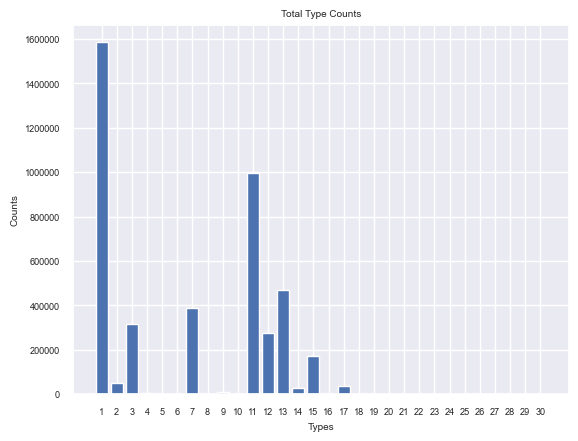
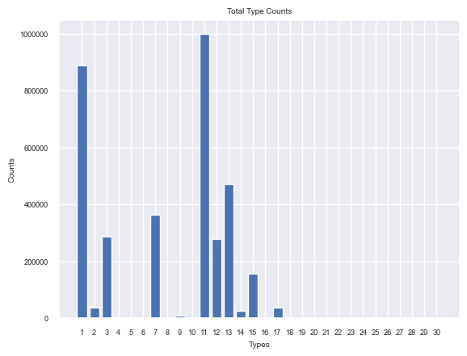
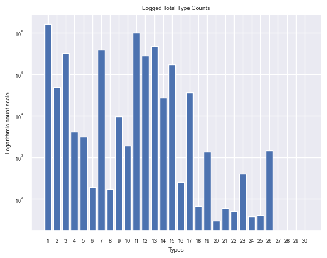
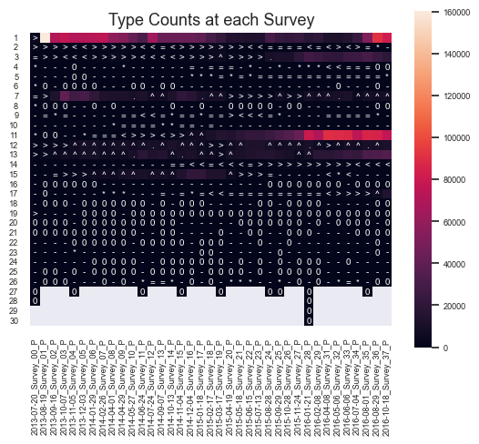
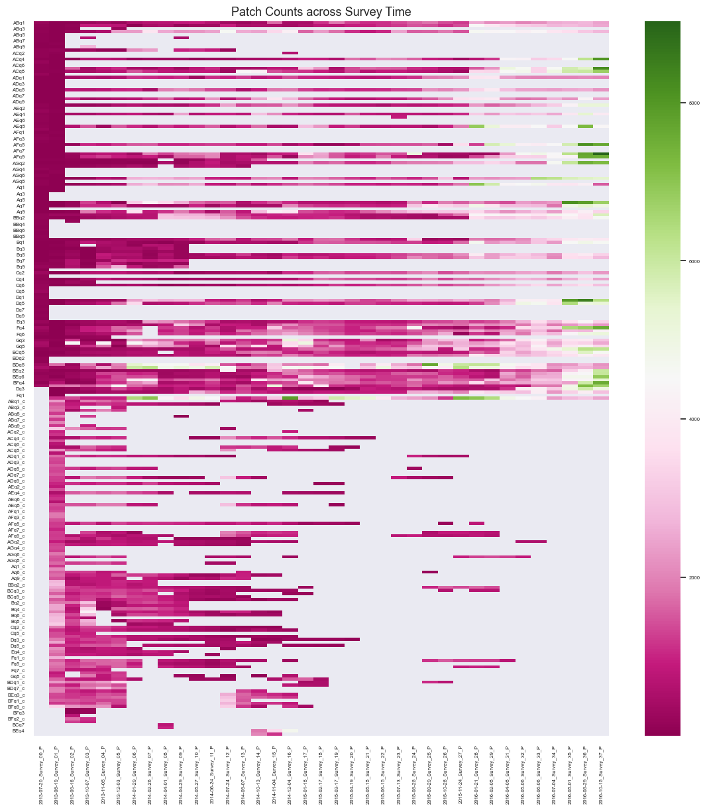
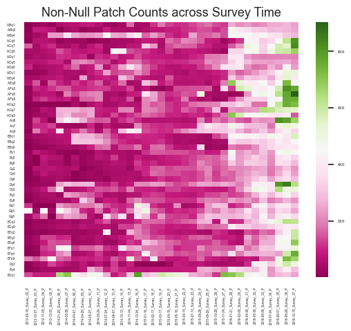

# Intro / Background
The main task that this project set out to accomplish was the identification and enumeration of all species present in a time series dataset of images taken by our project partner, Professor Mark Novak. A subset of the dataset images came coupled with .xml files containing x and y locations of each species in the picture, all of which were identified and labeled by hand. Each hand-labeled picture also came with a .xls file, which contained the total number of instances identified for each class type present in the corresponding picture.  Due to the massive amount of time it took to label even a small portion of the dataset by hand, we set out to train a machine learning model, using the hand-labeled data as a validation set, that could identify each instance of a species, and its correct type, in every picture in the entire time series dataset.

# Data Analysis
As this is an object detection project, the main purpose in analyzing our data is to determine the frequencies of the interested species, and how these species were distributed and varied amongst different patches and across surveys. We hope that the knowledge of these approximate distributions can help make accurate and less biased models. The analysis and images below can be found in the [data analysis directory](https://github.com/NovakLab-EECS/OR_Intertidal_ExpPatch_ImageAnalysis-2/tree/master/data_analysis).


## Total Counts of Species
By going through all directories and patches, we were able to sum up the total counts for each species. We did this twice, once including cropped and uncropped images, and another time only including uncropped images.





We noticed the large amount of species types 1 and 11 for both runs, this is useful as they are in the set of interested species, however, it is possible that these can start biasing model predictions to those types, as they are the most abundant. We are also hesitant to include the cropped data into our model, as this increases the total abundance of types 1 and 11, without increasing the other species by much, and thus, might not provide a significant benefit in increasing the accuracy of our model.

## Types Distributed Amongst Surveys

If it becomes necessary to have more uniform counts for each type across surveys, we need to be able to determine the counts at each survey and patches. Here we look at the total counts for each type for a given survey across all surveys, ignoring cropped images. 


#### Heatmap symbol table
| Symbol  |  Counts |
|:---:|:---:|
|  0 |  counts = 50 |
|  - |  counts < 50 |
|  * |  50 <= counts <   100|
|  = |  100 <= counts <  500|
|  < |  500 <= counts <  1000|
|  > |  1000 <= counts < 5000|
|  ^ |  5000 <= counts < 10000|
|  . |  10000 <= counts 20000 |

We can see that a majority of the types are 0 throughout, very few types had a lot of counts, and the largest counts occurred in later surveys. If images were chosen selectively for their counts, this could mean that more images from the later surveys would be left out as they can increase the counts by a large factor. 

## Patches Across Surveys
Finally, we examined how the counts for each patch varied across surveys. We did this for both cropped and uncropped data. Cropped patches can be determined by the suffix “_c”, in the patch name. 


Through this analysis, it's abundantly clear that we have a lot of discontinued patches. This makes sense as our project partner initially intended on counting all patches, but this became too time consuming. We also noted that a lot of the cropped data had jagged time limes. By only including non-null patches and ignoring survery’s 0 and 1, we can see how total counts for species changes over time. This may be useful when analyzing our data serially.

# Prior Team's Strategies

The predecessor team initiated their object detection project by trying out a basic "image analysis pipeline" deploying a pretrained Resnet50 model. All the associated source code can be found in the resnet_scripts directory. They partitioned all the tagged images from the training set into varied size tiles, including (128, 128) and (256, 256), with each tile corresponding to a single instance of a specific species. They calculated the boundaries of these tiles based on x, y coordinates of the instance under consideration. These coordinates were fetched by parsing through the corresponding xml file of the image and iterating over it. The end result was an array of folders, each dedicated to a specific class type and containing a multitude of small tile images, each showcasing a single instance of the species. These folders were organized into a single main directory.

Then, they moved on to extract feature and label vectors from their tiles directory using PyTorch. The pretrained model deployed was Resnet50, as can be seen from this line of code:

```
  model = torch.hub.load('pytorch/vision:v0.10.0', 'resnet50', pretrained=True)
```
Once data transforms for tiles were prepared, they were forwarded to PyTorch's data loader using this code:

```
train_datasets = datasets.ImageFolder(root=data_dir,transform=data_transforms['train'])

train_dataloader = torch.utils.data.DataLoader(
        train_datasets,
        batch_size=BATCH_SIZE,
        num_workers=NUM_WORKERS,
        shuffle=True,
    )
```
Feature and label vectors were saved as numpy arrays. Once these arrays were formed, they were passed to a classifier for making predictions. The sklearn MLP classifier was the classifier utilized in this experiment. It was used to create an instance and make predictions as shown in the following lines:

```
clf = MLPClassifier(activation='relu', solver='adam', hidden_layer_sizes=(4096), learning_rate='adaptive', max_iter=10000)

clf.fit(features_np[0:MAX_ITERATION-1], labels_np[0:MAX_ITERATION-1])

predicted_label = clf.predict([features_np[MAX_ITERATION-1]])
actual_label = labels_np[MAX_ITERATION-1]
print(f"Predicted_label: {predicted_label}  Actual_label {actual_label}")
```
The outcome of this method was not up to their expectations as the tile generation process yielded too many tiles devoid of species, resulting in over representation of no-class boxes. This skewed the predictions in favor of no-class boxes and led to incorrect predictions for tiles that actually contained species. They attempted numerous strategies to rectify this class imbalance issue, including resampling minority classes and modifying the loss function, but they didn't manage to achieve high accuracies for the target species.

## Past Team's Yolov5 Strategy

The previous team required bounding boxes for the objects YOLO would classify, so they manually created bounding boxes for each instance of a species based on the provided center xy coordinate points. They generated approximately 35 images, some partially and others fully labeled with bounding boxes, for training their YOLOv5 model. They ran the YOLO model using the HPC server. They installed all YOLO dependencies in a python virtual environment and activated tmux for the possibility to detach from the session without halting the run. They requested a GPU on the server using this command:

```
srun -A cs462 -p share -c 2 -n 2 --gres=gpu:1 -t 2-00:00:00 --pty bash
```
Once allocated a GPU by the server, they executed the following command from the "yolov5" directory:

```
python3 train.py --epochs 1500 --data dataset.yaml --weights yolov5m.pt --cache --freeze 10 --img 1280 --batch 2 --name [INSERT NAME OF RUN]
```

Alternatively, they suggested running a bash script to train YOLO without attaching it to an ongoing process to eliminate the risk of job termination.
The bash script is as follows:

train_yolo.bash
```
#!/bin/bash
#SBATCH -J train
#SBATCH -A cs462
#SBATCH -p share
#SBATCH -c 2
#SBATCH -n 2
#SBATCH -t 2-00:00:00
#SBATCH --gres=gpu:1
#SBATCH --mail-type=BEGIN,END,FAIL
#SBATCH --mail-user=<youremail@oregonstate.edu>

source "<path to  venv bin/activate>"
python3 train.py --epochs ${1} --data dataset.yaml --weights yolov5m.pt --cache --freeze 10 --img 1280 --batch 2 --name ${2}
```
They ran the script using this command:
```
sbatch train_yolo.bash <# of epochs> <run name>

```

From their various model runs, they determined the optimal parameters to be 10 layers for freezing, 1280 for image size, 2 for batch size, and 1500 for epochs. As their labeled bounding box dataset was insufficient to achieve the desired accuracy level, they aimed to automate the process of augmenting their training data. They initiated a semi-supervised learning approach using YOLO. This process entailed using YOLO to infer bounding boxes on new data, then a Python script would check whether the bounding box was correctly classified and whether its size appropriately fits the corresponding class. If the bounding box was deemed accurate, it was included in the training set.

# P2B Approach

P2BNet is a novel object detection model that was introduced in the paper "P2BNet: Point-to-Box Network for Object Detection" by Zhiqiang Shen, Jiaxiong Qiu, Weiming Dong, and Nong Sang. The main idea behind P2BNet is to convert the problem of object detection from a point-based prediction task to a box-based prediction task.

The model is a two-stage architecture, similar to that of the popular Faster R-CNN model. In the first stage, P2BNet uses a backbone network, such as ResNet or VGG, to extract features from the input image. These features are then fed into a Region Proposal Network (RPN) to generate a set of potential object regions, or "proposals."

In the second stage, P2BNet takes the proposals generated by the RPN and uses them to predict the final bounding boxes for the objects in the image. However, instead of predicting the bounding boxes directly, P2BNet uses a Point-to-Box (P2B) module to convert the predictions into a box-based format.

The P2B module is a novel component of P2BNet that is designed to address the limitations of point-based prediction methods. It takes as input a set of keypoints, or "points," that correspond to the locations of potential objects in the image, and generates a set of bounding boxes that tightly enclose these points.

The P2B module is implemented as a fully convolutional neural network (CNN) that takes the features extracted by the backbone network as input and produces a set of box predictions as output. The P2B module is trained end-to-end with the rest of the model, and uses a combination of convolutional layers, non-linear activation functions, and pooling layers to learn the mapping from points to boxes.

Finally, P2BNet uses a post-processing step to merge overlapping box predictions and remove duplicate detections, resulting in a final set of high-confidence object detections.

We replaced the previous teams YOLO approach with the P2BNet approach to benefit from its box-based prediction task, which we believe will provide better results for our specific problem of species identification in images.

# Model Refinement
As part of our efforts to improve the performance of our object detection model, Our team has layed out a process for model refinement and data augmentation. This plan outlines the steps we will undertake to ensure our model is more accurate and robust in detecting objects within various environments.

## Data Augmentation:
a. Implement various augmentation techniques to increase the diversity and size of our dataset, such as:
  1. Horizontal and vertical flipping
  2. Rotation
  3. Scaling and resizing
  4. Shearing and skewing
  5. Random cropping
  6. Brightness and contrast adjustments
  7. Noise injection

b. Apply these augmentations in a balanced manner to avoid overfitting and ensure the model generalizes well to new, unseen data.

c. Use a data augmentation library like Albumentations, imgaug, or build custom augmentation functions to streamline the process.

## Model Selection and Architecture Refinement:

a. Choose a suitable baseline model, such as YOLO, Faster R-CNN, or SSD, that has demonstrated strong performance alongside P2BNet.

b. Optimize the model architecture by adjusting parameters such as the number of layers, filter sizes, and activation functions.

c. Incorporate techniques like batch normalization, dropout, and skip connections to improve model performance and reduce overfitting.

## Model Training:

a. Split the pre-processed and augmented dataset into training, validation, and testing sets.

b. Train the model using a suitable optimization algorithm (e.g., Adam, RMSprop) and loss function (e.g., cross-entropy loss, IoU loss).

c. Monitor the model's performance using metrics like mean average precision (mAP) and Intersection over Union (IoU) on the validation set during training.

d. Employ techniques like early stopping, learning rate scheduling, and model checkpointing to prevent overfitting and ensure the most accurate model is saved.

## Model Evaluation and Hyperparameter Tuning:
a. Evaluate the trained model's performance on the test set to obtain an unbiased estimate of its accuracy and generalization ability.

b. Perform hyperparameter tuning using techniques like grid search, random search, or Bayesian optimization to further optimize the model's performance.

c. Re-train and evaluate the model with the optimal set of hyperparameters to maximize its object detection capabilities.

## Model Deployment and Continuous Improvement:
a. Deploy the refined object detection model on the remaining un-annotated Serial Image Analysis data.

b. Monitor the model's performance on remaining serial image analysis data and gather feedback from project partner (Mark Novak) to identify areas for improvement.

By following this plan, we will be able to develop a more accurate and robust object detection model that can effectively detect and classify objects in a wide variety of scenarios. 
